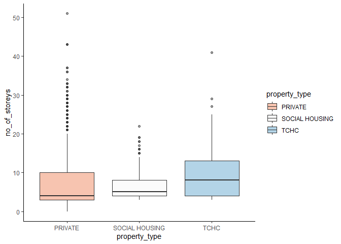
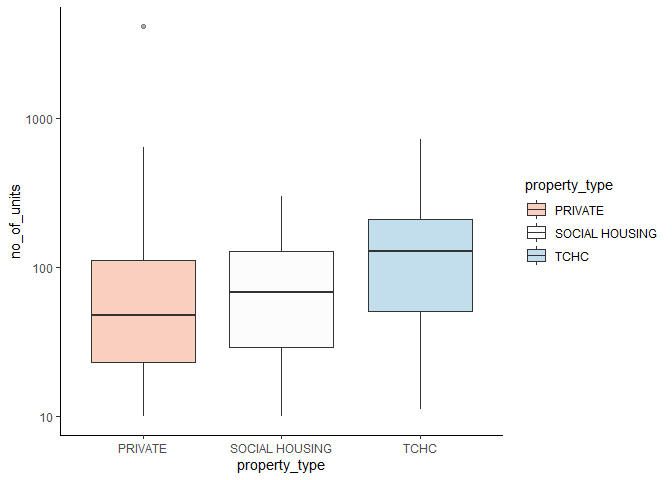

<!-- README.md is generated from README.Rmd. Please edit that file -->

# assignmentB2

<!-- badges: start -->
<!-- badges: end -->

The goal of the package `assignmentB2` is to calculate the summary
statistics (min, max, mean, median) and create a boxplot of a variable
in a data frame across different groups more conveniently.

## Installation

This package is not yet on [CRAN](https://CRAN.R-project.org). But you
can download it from this repository using the following
[R](https://www.r-project.org/) command.

``` r
devtools::install_github("stat545ubc-2021/Yitong_Zhao_AssignmentB")
```

## Example

This is a basic example which shows you how to use the function
`summary_and_boxplot_by_group()` in this package:

``` r
suppressPackageStartupMessages(library(assignmentB2))
summary_and_boxplot_by_group(datateachr::apt_buildings, property_type, no_of_storeys)
#> [[1]]
#> # A tibble: 3 x 6
#>   property_type    min   max  mean median     n
#>   <chr>          <dbl> <dbl> <dbl>  <dbl> <int>
#> 1 PRIVATE            0    51  7.63      4  2888
#> 2 SOCIAL HOUSING     3    22  6.58      5   240
#> 3 TCHC               3    41  9.55      8   327
#> 
#> [[2]]
```



You can also specify the argument `alpha` and `scale_y` change the
default transparency and scale the y-axis of the boxplot to make it look
better.

``` r
summary_and_boxplot_by_group(datateachr::apt_buildings, property_type, no_of_units,
                             alpha = 0.4, scale_y = TRUE)
#> [[1]]
#> # A tibble: 3 x 6
#>   property_type    min   max  mean median     n
#>   <chr>          <dbl> <dbl> <dbl>  <dbl> <int>
#> 1 PRIVATE            0  4111  85.5     47  2888
#> 2 SOCIAL HOUSING    10   297  82.9     68   240
#> 3 TCHC              11   719 146.     128   327
#> 
#> [[2]]
#> Warning: Transformation introduced infinite values in continuous y-axis
#> Warning: Removed 2 rows containing non-finite values (stat_boxplot).
```



More instructions about how to use the function
`summary_and_boxplot_by_group()` can be found using the following
command:

``` r
?summary_and_boxplot_by_group
```
