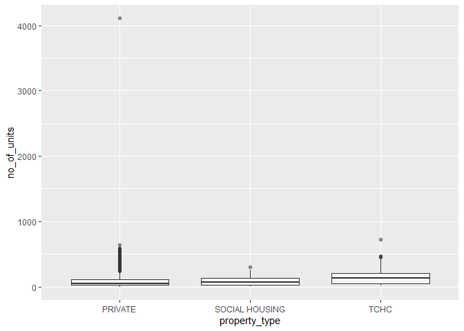
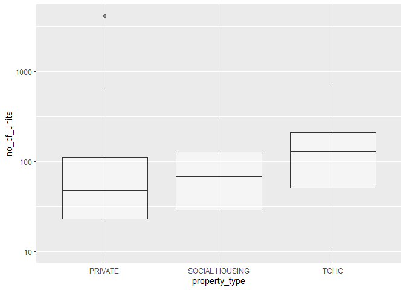

STAT 545B Assignment B1
================
Yitong Zhao

# Setup

Begin by loading the data and the required packages below:

``` r
suppressPackageStartupMessages(library(datateachr))
suppressPackageStartupMessages(library(tidyverse))
suppressPackageStartupMessages(library(testthat))
```

# Exercise 1 & 2: Make and Document a Function

In the data analysis of STAT 545A, I repeated the code to calculate the
summary statistics and create boxplot across different groups for
comparison. Therefore, I would like to make a function called
`summary_and_boxplot_by_group()` to do the job for me.

Below is the implementation of the function.

``` r
#' @title Create summary statistics and boxplot across groups
#' 
#' @description This function calculates the summary statistics (min, max, mean, median) of a variable in a data frame
#' across different groups. It also creates a boxplot where x-axis represents groups and y-axis represents the variable.
#' 
#' @param data A data frame containing the data.
#' @param group The column containing different groups, which decides how the data will be grouped.
#' @param var A numeric vector. Summary statistics are computed based on it.
#' @param drop_na A logical value indicating whether NA values should be stripped before the computation proceeds.
#' If \code{TRUE}, NA values will be removed. If \code{FALSE}, NA values will be kept.
#' The default value is \code{TRUE}.
#' @param alpha A numeric value representing the transparency of the boxplot.
#' The default value is 0.5,
#' @param scale_y A logical value indicating whether the y-axis of the boxplot should be transformed to log10 scale.
#' If \code{TRUE}, y-axis will be scaled, otherwise \code{FALSE}. The default value is \code{FALSE}.
#' 
#' @return A list containing (1) a tibble of summary statistics and, (2) the boxplot.


summary_and_boxplot_by_group <- function(data, group, var, drop_na = TRUE, alpha = 0.5, scale_y = FALSE) {
  if(!is.numeric(data[[var]])) {
    stop('Sorry, this function only works for numeric column!\n',
         'You have provided an object of class: ', class(data[[var]])[1])
  }
  if (!is.numeric(alpha)) {
    stop('Sorry, `alpha` has to be numeric!\n',
         'You have provided `alpha` of class: ', class(alpha)[1])
  }
  if (!is.logical(drop_na) || !is.logical(scale_y)) {
    stop('Sorry, `drop_na` and `scale_y` has to be logical!\n',
         'You have provided `drop_na` of class: ', class(drop_na)[1], '\n',
         'You have provided `scale_y` of class: ', class(scale_y)[1])
  }
  var = sym(var)
  group = sym(group)
  
  # compute min, max, mean and median of variable `var` grouped by `group`
  summary <- data %>%
    group_by({{group}}) %>%
    summarise(min = min({{var}}, na.rm = drop_na),
              max = max({{var}}, na.rm = drop_na),
              mean = mean({{var}}, na.rm = drop_na),
              median = median({{var}}, na.rm = drop_na),
              n = n()
    )
  
  # create boxplot
  plot <- data %>%
    ggplot(aes({{group}}, {{var}})) +
    geom_boxplot(alpha = alpha)
  
  if (scale_y) {
    plot <- plot + scale_y_log10()
  }
  
  result <- list(summary, plot)
  return (result)
}
```

# Exercise 3: Examples

The `apt_buildings` dataset is used in the examples. With the function
`summary_and_boxplot_by_group()`, we can get the summary statistics and
boxplot of `no_of_units` grouped by `property_type` with only one line
of code.

``` r
summary_and_boxplot_by_group(apt_buildings, "property_type", "no_of_units")
```

    ## [[1]]
    ## # A tibble: 3 x 6
    ##   property_type    min   max  mean median     n
    ##   <chr>          <dbl> <dbl> <dbl>  <dbl> <int>
    ## 1 PRIVATE            0  4111  85.5     47  2888
    ## 2 SOCIAL HOUSING    10   297  82.9     68   240
    ## 3 TCHC              11   719 146.     128   327
    ## 
    ## [[2]]

<!-- -->

The above boxplot is hard to read because of some outliers. We can set
the parameter `scale_y` to `TRUE` to make the plot look better.

``` r
summary_and_boxplot_by_group(apt_buildings, "property_type", "no_of_units", scale_y = TRUE)
```

    ## [[1]]
    ## # A tibble: 3 x 6
    ##   property_type    min   max  mean median     n
    ##   <chr>          <dbl> <dbl> <dbl>  <dbl> <int>
    ## 1 PRIVATE            0  4111  85.5     47  2888
    ## 2 SOCIAL HOUSING    10   297  82.9     68   240
    ## 3 TCHC              11   719 146.     128   327
    ## 
    ## [[2]]

    ## Warning: Transformation introduced infinite values in continuous y-axis

    ## Warning: Removed 2 rows containing non-finite values (stat_boxplot).

<!-- -->

The function can only calculate the summary statistics of numeric
variables. If non-numeric column is passed to the third argument `var`,
an error will occur.

``` r
summary_and_boxplot_by_group(apt_buildings, "property_type", "air_conditioning")
```

    ## Error in summary_and_boxplot_by_group(apt_buildings, "property_type", : Sorry, this function only works for numeric column!
    ## You have provided an object of class: character

# Exercise 4: Test the Function

The function needs to be tested in two aspects. Firstly, it should
calculate the summary statistics correctly. Secondly, a boxplot should
be created.

The dataset I used for testing is quite simple.

``` r
(test_data <- tibble(group = c("A", "B", "C", "A", "C", "A", "B"), 
                    value = c(1, 2, 3, 4, 5, NA, 6),
                    id = c("1", "2", "3", "4", "5", "6", "7")))
```

    ## # A tibble: 7 x 3
    ##   group value id   
    ##   <chr> <dbl> <chr>
    ## 1 A         1 1    
    ## 2 B         2 2    
    ## 3 C         3 3    
    ## 4 A         4 4    
    ## 5 C         5 5    
    ## 6 A        NA 6    
    ## 7 B         6 7

1.  Test if summary statistics are correct when removing NA values

``` r
expected_1 <- tibble(group = c("A", "B", "C"),
                     min = c(1, 2, 3),
                     max = c(4, 6, 5),
                     mean = c(2.5, 4.0, 4.0),
                     median = c(2.5, 4.0, 4.0),
                     n = c(3, 2, 2))
test_that("Test if summary statistics are correct when removing NA values", 
          expect_equal(summary_and_boxplot_by_group(test_data, "group", "value")[[1]], expected_1))
```

    ## Test passed

2.  Test if summary statistics are correct when keeping NA values

``` r
expected_2 <- tibble(group = c("A", "B", "C"),
                     min = c(NA, 2, 3),
                     max = c(NA, 6, 5),
                     mean = c(NA, 4.0, 4.0),
                     median = c(NA, 4.0, 4.0),
                     n = c(3, 2, 2))
test_that("Test if summary statistics are correct when keeping NA values",
          expect_equal(summary_and_boxplot_by_group(test_data, "group", "value", drop_na = FALSE)[[1]], expected_2))
```

    ## Test passed

3.  Test if there is an error when the type of argument is wrong

``` r
test_that("Test if there is an error when the type of argument is wrong", {
          # `var` is not numeric
          expect_error(summary_and_boxplot_by_group(test_data, "group", "id"))
          # `drop_na` is not logical
          expect_error(summary_and_boxplot_by_group(test_data, "group", "value", drop_na = 0))
          # `alpha` is not numeric
          expect_error(summary_and_boxplot_by_group(test_data, "group", "value", alpha = "0.5"))
          # `scale_y` is not logical
          expect_error(summary_and_boxplot_by_group(test_data, "group", "value", scale_y = 1))
})
```

    ## Test passed

4.  Test if the boxplot is correct

``` r
plot <- summary_and_boxplot_by_group(test_data, "group", "value", alpha = 0.6)[[2]]

test_that("Test if boxplot is correct", {
          # test if x-axis is `group`
          expect_true(as.character(rlang::get_expr(plot$mapping$x)) == "group" ||
                      as.character(rlang::get_expr(plot$layers[[1]]$mapping$x)) == "group")
          # test if y-axis is `value`
          expect_true(as.character(rlang::get_expr(plot$mapping$y)) == "value" ||
                      as.character(rlang::get_expr(plot$layers[[1]]$mapping$y)) == "value")
          # test if it is boxplot
          expect_true("GeomBoxplot" %in% class(plot$layers[[1]]$geom))
          # test alpha
          expect_equal(plot$layers[[1]]$aes_params$alpha, 0.6)
})
```

    ## Test passed
